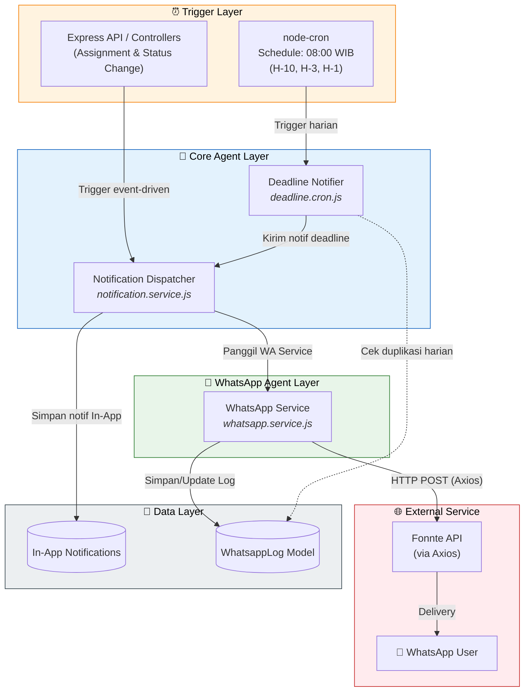
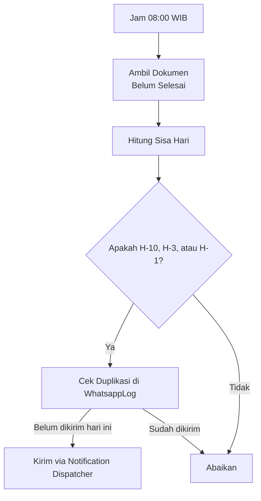

# Arsitektur Agent — Sistem Notifikasi WhatsApp

> **Aplikasi Monitoring Dokumen Kerja**
> Versi Dokumen: 2.0 · Terakhir diperbarui: 14 Juni 2026

---

## Daftar Isi

1. [Gambaran Umum Arsitektur Agent](#1-gambaran-umum-arsitektur-agent)
2. [Agent: WhatsApp Service](#2-agent-whatsapp-service)
3. [Agent: Deadline Notifier](#3-agent-deadline-notifier)
4. [Agent: Notification Dispatcher (Event-Driven)](#4-agent-notification-dispatcher-event-driven)
5. [Agent: Dynamic Configuration (System Settings)](#5-agent-dynamic-configuration-system-settings)
6. [Database Model: WhatsappLog & SystemSetting](#6-database-model-whatsapplog--systemsetting)

---

## 1. Gambaran Umum Arsitektur Agent

Sistem notifikasi pada **Aplikasi Monitoring Dokumen Kerja** dirancang menggunakan pendekatan arsitektur berbasis *agent* independen yang saling terintegrasi. Hal ini memastikan setiap proses notifikasi, baik in-app maupun WhatsApp, berjalan dengan andal tanpa saling mengganggu (fail-safe).

### 1.1 Daftar Agent Utama

| Agent | File | Tanggung Jawab Utama |
|---|---|---|
| **WhatsApp Service** | `whatsapp.service.js` | Berkomunikasi secara langsung dengan API Fonnte via Axios, menangani exponential backoff & retries. |
| **Deadline Notifier** | `deadline.cron.js` | Cron job harian pada 08:00 WIB untuk mengecek deadline dokumen (H-10, H-3, H-1). |
| **Notification Dispatcher** | `notification.service.js` | Menangani notifikasi *event-driven* (misal: assignment teknisi, perubahan status). |
| **Dynamic Configuration** | `public.routes.js` | Menangani pembacaan dan _fallback logic_ pengaturan sistem secara *on-the-fly* dari _database_ (misal: Access Code). |

### 1.2 Flow Diagram Arsitektur (Mermaid)



---

## 2. Agent: WhatsApp Service

> **File:** `src/services/whatsapp.service.js`
> **Tanggung Jawab:** Service utama untuk integrasi API WhatsApp.

WhatsApp Service bertindak sebagai antarmuka eksklusif antara sistem internal dan Fonnte API menggunakan librari **Axios**. Agent ini memiliki fitur keandalan tinggi (reliability) melalui implementasi **retry dengan exponential backoff**.

### 2.1 Fitur Utama
1. **HTTP Client:** Menggunakan Axios untuk request API yang stabil.
2. **Exponential Backoff:** Jika pengiriman gagal (misal: timeout atau Fonnte down), agent akan mencoba ulang secara otomatis dengan jeda waktu yang bertambah (misalnya percobaan 1 jeda 2s, percobaan 2 jeda 4s, dst.).
3. **Pencatatan Status:** Terhubung langsung ke model `WhatsappLog` untuk melacak status akhir pesan.

### 2.2 Cuplikan Alur Retries (Exponential Backoff)

```javascript
async function sendWithRetry(payload, attempt = 1) {
    const MAX_RETRIES = 3;
    try {
        const response = await axios.post('https://api.fonnte.com/send', payload, {
            headers: { 'Authorization': process.env.FONNTE_TOKEN }
        });
        return response.data;
    } catch (error) {
        if (attempt <= MAX_RETRIES) {
            const delay = Math.pow(2, attempt) * 1000; // Exponential backoff (2s, 4s, 8s)
            await new Promise(res => setTimeout(res, delay));
            return sendWithRetry(payload, attempt + 1);
        }
        throw error;
    }
}
```

---

## 3. Agent: Deadline Notifier

> **File:** `src/cron/deadline.cron.js`
> **Tanggung Jawab:** Memantau tenggat waktu dokumen dan mengingatkan PIC secara otomatis.

`deadline.cron.js` menggunakan *node-cron* untuk berjalan sebagai proses latar belakang secara berkala.

### 3.1 Aturan Jadwal dan Threshold
- **Jadwal Eksekusi:** Setiap hari pada **08:00 WIB**. Hal ini memastikan pesan WA dikirim pada awal jam kerja operasional.
- **Batas Waktu (Threshold):** Sistem akan mengecek dokumen yang belum selesai (`status != assigned`) dan memicu notifikasi jika sisa waktu menuju `deadline_sn` adalah:
  - **H-10** (Peringatan Awal)
  - **H-3** (Peringatan Menengah)
  - **H-1** (Peringatan Kritis)

### 3.2 Diagram Alur Pengecekan Deadline



---

## 4. Agent: Notification Dispatcher (Event-Driven)

> **File:** `src/services/notification.service.js` dan Controllers
> **Tanggung Jawab:** Menangani *trigger* notifikasi secara real-time berdasarkan aksi pengguna (Event-Driven).

Selain proses batch via Cron, notifikasi WA juga dikirim secara instan (event-driven). Proses ini diinisiasi oleh layer Controller lalu diproses oleh `notification.service.js`.

### 4.1 Trigger Event-Driven
Notifikasi WhatsApp akan langsung dipicu secara real-time pada kondisi berikut:
1. **Assignment Teknisi:** Ketika teknisi baru ditugaskan ke sebuah dokumen, sistem akan segera memberitahukan teknisi tersebut via WA.
2. **Perubahan Status Dokumen:** Jika dokumen berubah status (misalnya dari *Draft* ke *Review* atau *Approved*), sistem mengirim update status tersebut ke pihak yang berkepentingan.

### 4.2 Alur Pemanggilan

1. **Controller:** Melakukan update data (misal `status` di tabel Document).
2. **Dispatcher (`notification.service.js`):** Di-invoke oleh Controller. Dispatcher bertugas mencatat log notifikasi In-App dan Socket.io.
3. **WhatsApp Request:** Jika tipe event adalah *assignment* atau *status change*, Dispatcher akan melimpahkan *payload* pesan ke `whatsapp.service.js`.

---

## 5. Database Model: WhatsappLog
## 5. Agent: Dynamic Configuration (System Settings)

> **File:** `src/routes/public.routes.js` dan `src/routes/settings.routes.js`
> **Tanggung Jawab:** Middleware dinamis untuk verifikasi akses Kanban Publik.

Fitur terbaru memperkenalkan mekanisme *Dynamic Config* menggunakan tabel `SystemSetting`. Agent ini bekerja secara *interceptive* sebagai *middleware* sebelum permintaan (request) sampai ke *controller* data Kanban.

1. Mengambil kunci sandi (`BOARD_ACCESS_CODE`) dari Database secara *real-time*.
2. Membandingkan input pengguna dengan hasil _query_.
3. Melakukan *fallback* ke `process.env.BOARD_ACCESS_CODE` jika _database query_ gagal.

---

## 6. Database Model: WhatsappLog & SystemSetting

Pembaruan terbaru memasukkan 2 entitas model krusial:

### 6.1 `WhatsappLog`
Menyimpan riwayat pengiriman pesan WA.

| Kolom | Tipe | Deskripsi |
|---|---|---|
| `id` | Integer (PK) | Auto-increment identifier. |
| `phone_number` | Varchar | Nomor WhatsApp tujuan. |
| `message` | Text | Isi pesan aktual yang dikirim. |
| `status` | Enum | Status: `pending`, `sent`, `delivered`, `failed`. |
| `retry_count` | Integer | Berapa kali pengiriman diulang. |
| `reference_type` | Varchar | Jenis referensi, misal `document` atau `assignment`. |
| `reference_id` | Integer | ID dari tabel referensi tersebut. |
| `error_detail` | Text | Menyimpan detail error dari Axios/Fonnte jika gagal. |
| `created_at` | DateTime | Waktu pengiriman (berguna untuk filter deduplikasi Harian). |

*Dokumen ini merupakan referensi resmi untuk mekanisme notifikasi Aplikasi Monitoring Dokumen Kerja dan Pengelolaan Inventaris. Setiap penambahan fitur WA baru wajib berpedoman pada alur arsitektur agent ini.*
